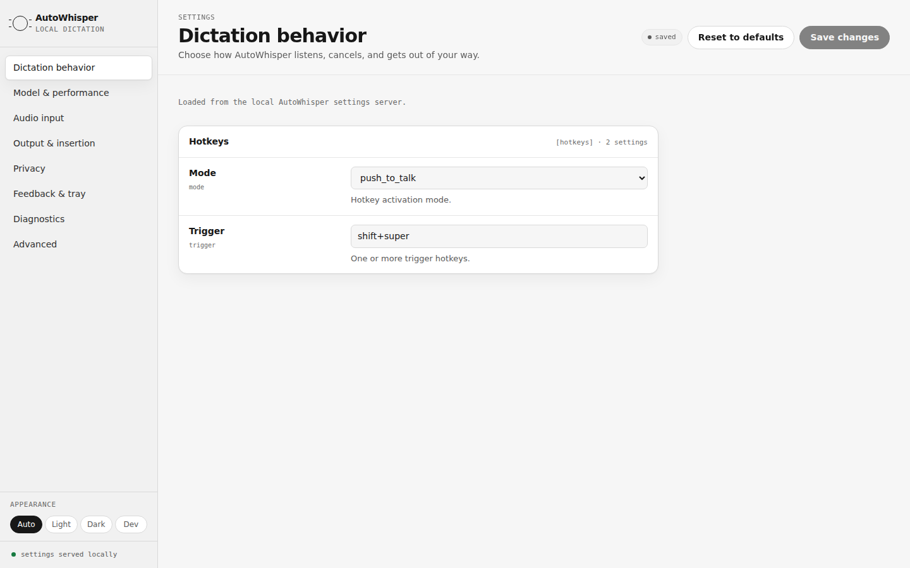
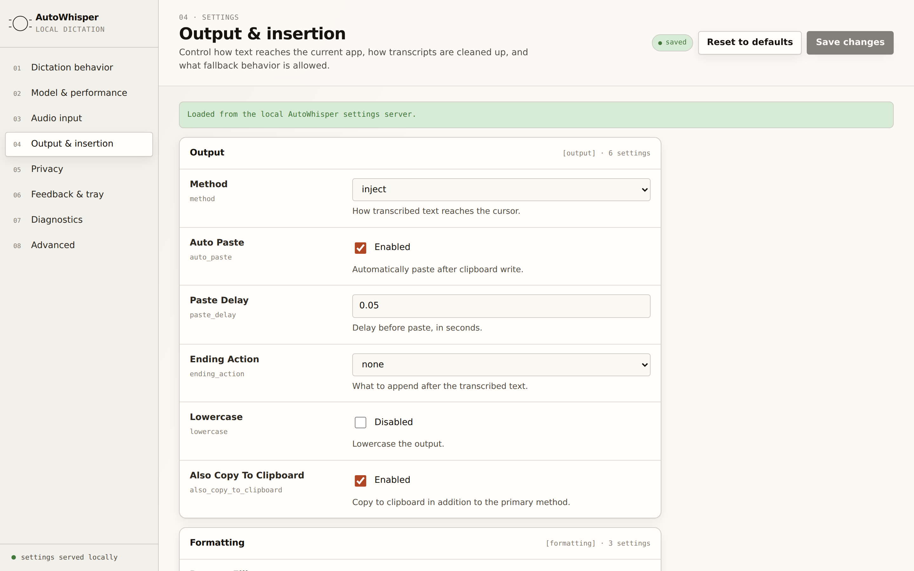
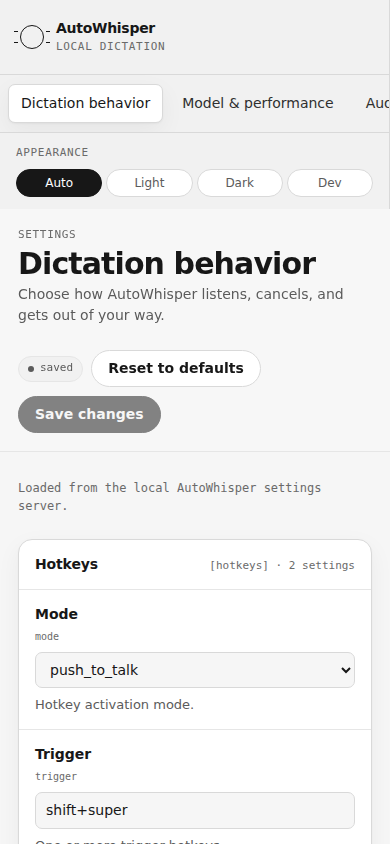
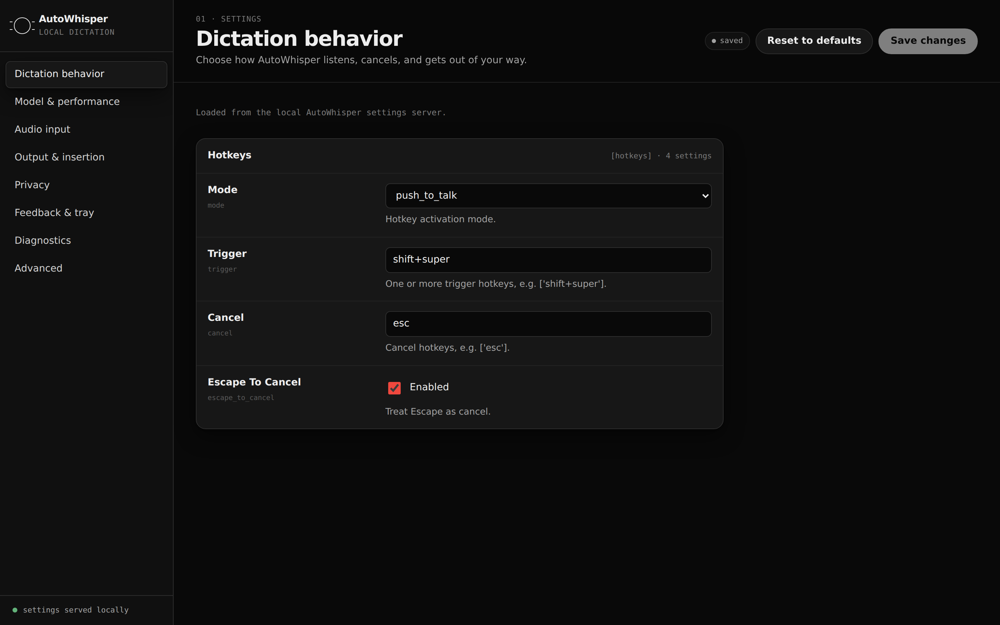
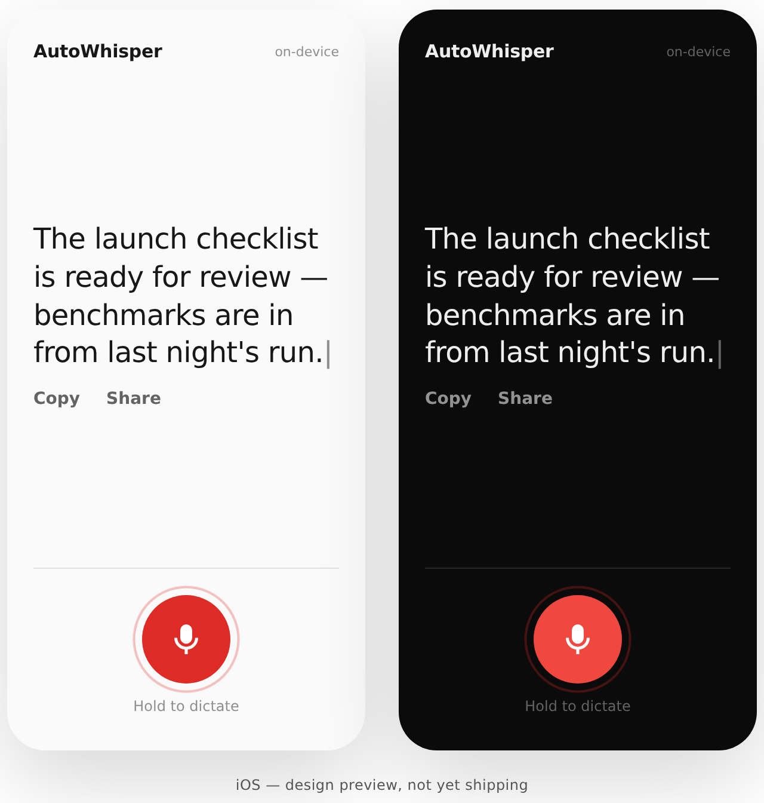
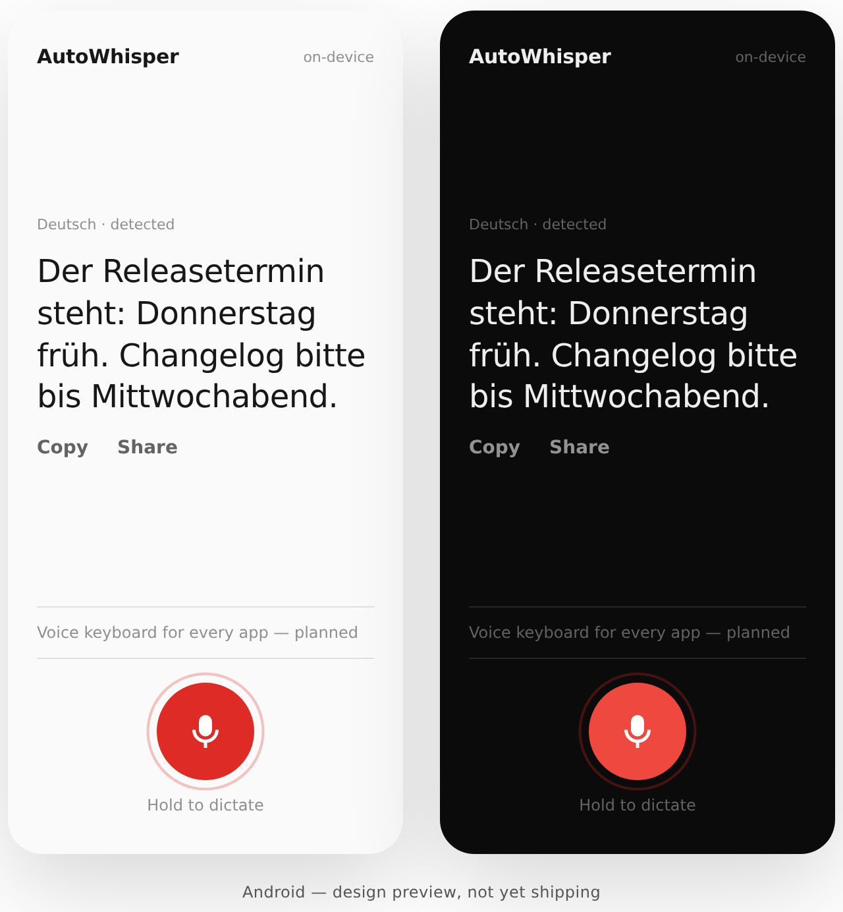
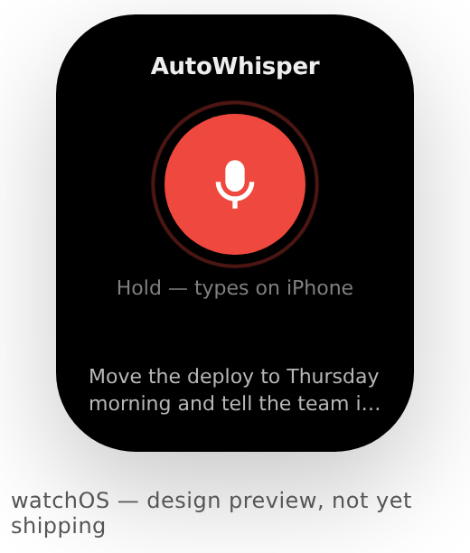

# AutoWhisper

Local voice-to-text for your desktop. Press a hotkey, speak, release — text appears at your cursor.

Native C++ application powered by [whisper.cpp](https://github.com/ggerganov/whisper.cpp). Runs entirely offline. Linux is production-ready, macOS ships as a notarized beta, and the Windows port is in active development.

## Interface

The settings UI is served locally by the app itself — no framework, no cloud. Real captures, light and dark:

<picture>
  <source media="(prefers-color-scheme: dark)" srcset="site/assets/screenshots/settings-desktop-dark.png">
  
</picture>

| Output & transcript cleanup | Phone width | Dark mode |
|---|---|---|
|  |  |  |

### Mobile (design previews)

Native iOS, Android, and watchOS apps are on the roadmap (post-1.0; see
`docs/plans/2026-06-12-production-readiness-plan.md`). These are design
previews from `design/mobile/`, **not shipping apps** — same local-first
rule: speech is processed on your devices.

| iOS — design preview | Android — design preview | watchOS — design preview |
|---|---|---|
|  |  |  |

Motion is status-only — a breathing record affordance and a live caret
([demo](site/assets/screenshots/motion-ios.gif)), disabled under
`prefers-reduced-motion`.

## Install

```bash
sudo add-apt-repository ppa:primemanifold/autowhisper
sudo apt update
sudo apt install autowhisper
```

## Quick Start

```bash
autowhisper doctor              # check system requirements
systemctl --user enable --now autowhisper
```

Press `Shift+Super`, speak, release. Text appears at your cursor.

## Usage

```bash
autowhisper doctor              # diagnose system
autowhisper config ui           # open settings UI in the browser
autowhisper config edit         # edit config.toml in $EDITOR
autowhisper model list          # show available models
autowhisper model download <name>  # download a model (SHA-256 verified)
autowhisper run                 # run in foreground
```

View logs:
```bash
journalctl --user -u autowhisper -f
```

## Build from Source

### Dependencies (Ubuntu)

```bash
sudo apt install cmake g++ pkg-config \
  libx11-dev libxtst-dev libxext-dev libxi-dev libxrandr-dev \
  libgtk-3-dev libayatana-appindicator3-dev libpulse-dev libssl-dev
```

### Build

```bash
git clone https://github.com/primemanifold/autowhisper.git
cd autowhisper
cmake -B build -DCMAKE_BUILD_TYPE=Release
cmake --build build -j$(nproc)
```

The binary is at `build/autowhisper`.

### Options

| CMake Option | Default | Description |
|---|---|---|
| `AUTOWHISPER_ENABLE_CUDA` | OFF | Enable CUDA GPU acceleration via whisper.cpp |
| `AUTOWHISPER_ENABLE_TESTS` | ON | Build the Catch2 test suite |

```bash
# Build with CUDA support (requires CUDA toolkit 12.x)
sudo apt install cuda-toolkit-12-8  # or any 12.x version
cmake -B build -DCMAKE_BUILD_TYPE=Release \
  -DAUTOWHISPER_ENABLE_CUDA=ON \
  -DCMAKE_CUDA_ARCHITECTURES=native \
  -DCMAKE_CUDA_COMPILER=/usr/local/cuda-12.8/bin/nvcc
cmake --build build -j$(nproc)

# Run tests
cd build && ctest --output-on-failure
```

> **Note:** CUDA 13.x is not yet supported (whisper.cpp v1.7.3 uses deprecated CUDA
> runtime APIs removed in CUDA 13). Use CUDA 12.8 or 12.9 — the NVIDIA driver is
> backwards-compatible, so a newer driver works fine with an older toolkit.

## Configure

Run `autowhisper config` to open the settings GUI, or edit the config file directly:

```
~/.config/autowhisper/config.toml   # user config
/etc/autowhisper/config.toml        # system default
```

Example:
```toml
[model]
size = "distil-small.en"  # tiny.en (fastest) to distil-large-v3 (best)
device = "cuda"           # cuda, cpu, or auto
compute_type = "bfloat16" # bfloat16 (RTX 50xx), float16 (RTX 20-40xx)

[hotkeys]
mode = "push_to_talk"     # or "toggle"
trigger = ["shift+super"]

[output]
method = "inject"         # or "clipboard"
ending_action = "none"    # none, newline, or return_key
```

## Models

| Model | Size | Languages | Accuracy |
|-------|------|-----------|----------|
| tiny.en / tiny | ~78MB | English / 100+ | Good |
| base.en / base | ~148MB | English / 100+ | Better |
| distil-small.en | ~336MB | English | Very good (recommended) |
| small.en / small | ~488MB | English / 100+ | Very good |
| distil-large-v3 | ~1.5GB | English | Best English |
| large-v3-turbo | ~1.6GB | 100+ | Best multilingual speed/accuracy |
| large-v3 | ~3.1GB | 100+ | Maximum |

Speed depends on your hardware. Measure it yourself with the benchmark
harness (`bench/README.md`); for reference, `tiny.en` transcribes 11s of
audio in ~0.8s with 4 threads on a 2.8GHz Xeon vCPU (RTF 0.07), with zero
word errors on the smoke fixture.

### Languages

Models without an `.en`/`distil` suffix support 100+ languages. Set the
language explicitly or let Whisper detect it:

```toml
[model]
size = "large-v3-turbo"
language = "auto"   # or an ISO 639-1 code like "de", "es", "zh"
```

## Troubleshooting

```bash
autowhisper doctor                     # diagnose issues
journalctl --user -u autowhisper -f    # view logs
```

## License

Apache 2.0
